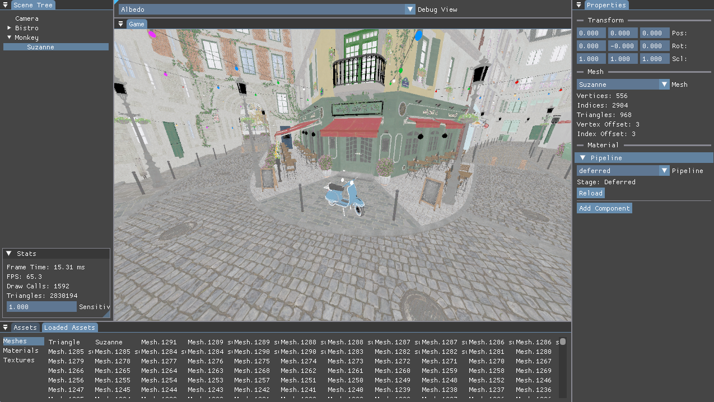

# Keptech

## Cloning

The repository vendors dependencies that don't support CMake natively using git submodules. To clone the repository with the submodules, run

```bash
git clone --recurse-submodules https://github.com/Miitto/Keptech.git
```

If the repository has already been cloned without the `--recurse-submodules` flag, the submodules can be initialized and updated by running

```bash
git submodule update --init --recursive
```

## Building

### Dependencies

[SDL3](https://github.com/libsdl-org/SDL) and [Slang](https://github.com/shader-slang/slang) can be automatically retrieved if they are not installed on the system. It is reccommended to have them installed on the system if the engine itself is being modified.

> Building Slang on Windows requires being run in a Visual Studio Developer Command Prompt. If on x64 ensure the x64 developer command prompt is used. This is only required on a clean build, if Slang has already been built, the project can be built from any terminal.

If Vulkan is enabled, the [Vulkan SDK](https://vulkan.lunarg.com/) and [VulkanMemoryAllocator](https://github.com/GPUOpen-LibrariesAndSDKs/VulkanMemoryAllocator) must be installed on the system. Vulkan Memory Allocator can be installed with the Vulkan SDK.

The included presets require [Ninja](https://ninja-build.org/).

### CMake

To generate the build files, run

```bash
cmake --preset <preset>
```

Then to build, run

```bash
cmake --build --preset <preset>
```

To build for release, append `--config Release` to the build command. `Debug` is the default configuration.

`clang-x64` is the most tested preset, although all presets should be functional.

The example projects are built by default. To skip building them set `KT_BUILD_EXAMPLES` to `OFF`.

Assuming a provided preset is used, examples can be run from the project root with:

```bash
./__output/<preset>/examples/<example>/Debug/<example>[.exe]
```

`.vscode/launch.json` also provides launch configurations for the examples.

## Features

### ECS

The engine uses an Entity Component System (ECS) architecture. EnTT is used as the ECS library, with a thin wrapper around it for ease of use, although the raw EnTT API can also be used if desired.

### Shaders

Slang is used as the shading language. A shader processor is provided that uses the Slang reflection API to generate C++ code for shader input layouts and shader binding. This allows for shader usage to be validated at compile time, and for shader input layouts to be generated automatically from the shader code.

CMake functions are provided to compile shaders at build time and embded the parsed shader data into a header file. The shader processor can also be directly linked to, to allow for shaders to be compiled at runtime.

The engine ships with a small shader library that provides some common shaders and shader utilities. This library is linked to each shader automatically by the shader processor, so its functionality is available in all shaders without needing to explicitly include it. This library can be found at `shaders/lib`. Shaders used by the engine directly can be found at `shaders/`.

### Rendering

The engine is set up to allow for multiple rendering backends. The rendering backend is abstracted behind a common interface, allowing for different rendering APIs to be used without changing the core engine code. The engine currently only supports Vulkan, with plans to support DirectX 12 in future.

## Examples

### Editor



The editor example is a simple scene editor. It allows the user to create and manipulate entities in a scene, as well as edit their components. It allows for shaders to be recompiled at runtime.

## Project Structure

### Core

The core module contains most of the engine code. This includes the renderer backend interface, base types and utilities.

### Renderers

This folder contains the renderer backend implementations. Each renderer backend can be selectively enabled or disabled using CMake options. The renderer backends are built as static libraries that are linked to the core module.

### Engine

This module contains most of the higher level engine code that will be used by end products interacting with the engine. This includes the renderer frontend, entry point definitions, and prelude headers.

### Logging

This is a small header only module that provides logging functionality. This is linked to by all other modules.

### Shader Processor

This module provides functionality for processing Slang shaders. It uses the Slang reflection API to generate C++ code for shader input layouts and shader binding. This allows for shader usage to be validated at compile time, and for shader input layouts to be generated automatically from the shader code.

### Shader Embedder

This is a small program used by CMake to generate header files for shaders at compile time. It uses the shader processor to parse the shader code then writes out the data to header files.

## Branch Overview

This repository holds some branches used for benchmarking different implementations of the Vulkan renderer. Each builds off of the previous unless otherwise noted.

### Basic

Per-mesh vertex buffers, no instancing, push constants for per object data.

### Fat Buffers

One large vertex buffer and one large index buffer for the entire scene, with offsets for each mesh. No instancing, push constants for per object data.

### Seperate Submits

Seperates out the rendering into three submits, one for the gBuffer pass, one for the lighting pass, and one for the post processing pass.

### Object Buffers

Writes per object data to a storage buffer each frame instead of using push constants. Allows the same data to be reused between passes, such as the object data for the gBuffer pass and then later for shadows. Draw calls are still per object and use indices into the storage buffer to get the per object data.
